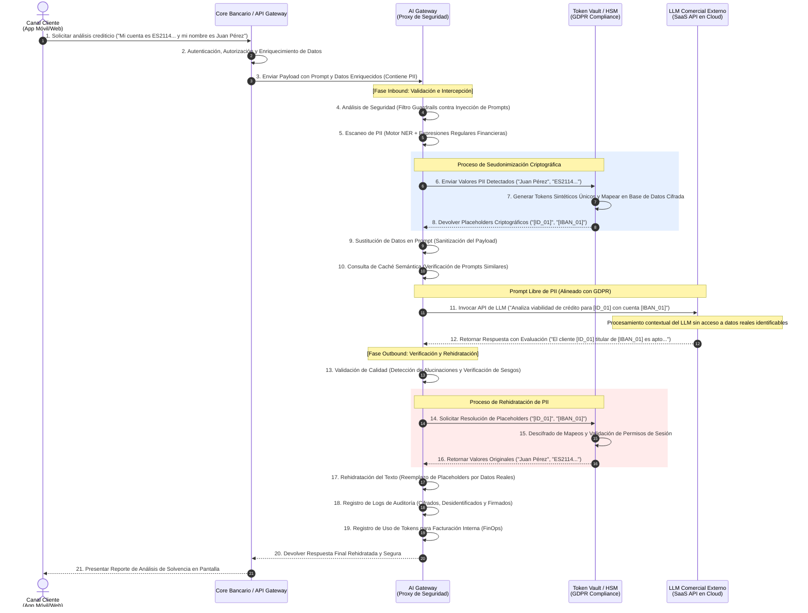

# Marco de Gobernanza de IA, Cumplimiento del EU AI Act y Privacidad de Datos en la Arquitectura Bancaria
**Documento de Arquitectura de Referencia y Directrices de Seguridad Enterprise**
**Autor:** Principal Enterprise AI Architect, AI Office
**Clasificación:** Confidencial / Uso Interno

---

## 1. Clasificación de Riesgos según el EU AI Act en el Ámbito Financiero

El Reglamento de Inteligencia Artificial de la Unión Europea (EU AI Act) establece un marco regulatorio basado en el riesgo que afecta directamente al desarrollo, despliegue e integración de sistemas de IA en el sector financiero. Para una entidad bancaria, el cumplimiento normativo no solo es un requisito legal (con multas de hasta el 7% de la facturación global anual o 35 millones de euros), sino un componente central del riesgo operacional y reputacional.

```
       ▲  [Riesgo Inaceptable] -> Prohibición Absoluta (Social Scoring, Manipulación)
      ╱█╲
     ╱███╲  [Alto Riesgo] -> Evaluación Crediticia, Scoring de Riesgo, Recursos Humanos
    ╱█████╲
   ╱███████╲  [Riesgo Limitado] -> Chatbots (Transparencia, Revelación de IA)
  ╱█████████╲
 ╱███████████╲  [Riesgo Mínimo] -> Filtros Spam, Optimización Interna (Sin regulación extra)
 └───────────┘
```

### 1.1. Prácticas de IA Prohibidas (Riesgo Inaceptable - Artículo 5)
Ciertas aplicaciones de IA están estrictamente prohibidas por suponer una amenaza para los derechos fundamentales de las personas:
*   **Social Scoring Bancario:** Sistemas de IA que evalúen o clasifiquen a personas físicas durante un período de tiempo basándose en su comportamiento social o características personales, dando lugar a un trato desfavorable en contextos ajenos a la recopilación original de datos (por ejemplo, negar una hipoteca basándose en la actividad del cliente en redes sociales o patrones de navegación no relacionados con el crédito).
*   **Sistemas de Categorización Biométrica:** Clasificación de personas según características protegidas (opiniones políticas, orientación sexual, raza, religión).
*   **Sistemas de Reconocimiento de Emociones:** Prohibidos en el lugar de trabajo y entornos educativos, lo cual limita su uso en la monitorización de empleados del banco.

### 1.2. Sistemas de IA de Alto Riesgo (Anexo III y Artículo 6)
En la banca minorista y corporativa, las aplicaciones más críticas entran de lleno en la categoría de **Alto Riesgo**, reguladas con severas obligaciones operativas y de desarrollo.

#### 1.2.1. Evaluación de la Solvencia (Credit Scoring) e Identificación de Riesgos
El EU AI Act clasifica explícitamente como **Alto Riesgo** a:
> *"Los sistemas de IA destinados a ser utilizados para evaluar la solvencia de las personas físicas o para establecer su puntuación crediticia (credit scoring)."*

**Justificación Regulatoria:** Estos sistemas determinan el acceso de los ciudadanos a recursos económicos esenciales (créditos hipotecarios, préstamos personales, tarjetas de crédito). Un sesgo algorítmico o un fallo en el modelo puede excluir sistemáticamente a colectivos vulnerables del sistema financiero, perpetuando desigualdades socioeconómicas.

Asimismo, se consideran de alto riesgo los sistemas de IA utilizados para:
*   **Tarificación y Evaluación de Riesgos en Seguros de Vida y Salud:** Evaluar riesgos y calcular primas de seguros aplicables a personas físicas.
*   **Sistemas de Contratación y Gestión de RRHH:** Sistemas de IA usados para filtrar currículums, evaluar candidatos durante entrevistas o tomar decisiones sobre promociones o despidos del personal bancario.

#### 1.2.2. Obligaciones Clave para Sistemas de Alto Riesgo
Para poner en producción un modelo de scoring crediticio basado en IA, la AI Office del banco debe certificar el cumplimiento de los siguientes pilares (Artículos 8-15):

| Requisito Técnico / Normativo | Descripción Operativa en Arquitectura Bancaria | Implementación Concreta |
| :--- | :--- | :--- |
| **Sistema de Gestión de Riesgos (Art. 9)** | Proceso sistemático y continuo durante todo el ciclo de vida de la IA para identificar, estimar y mitigar riesgos asociados al modelo. | Pruebas de estrés periódicas del modelo, análisis de escenarios adversos e integración con el marco global de Model Risk Management (MRM). |
| **Gobernanza de Datos (Art. 10)** | Los conjuntos de datos de entrenamiento, validación y prueba deben someterse a prácticas estrictas de gobernanza. Deben ser pertinentes, representativos, carecer de errores en la medida de lo posible y estar libres de sesgos discriminatorios. | Procesos de detección de sesgo (bias detection) utilizando métricas como *Disparate Impact* y *Equalized Odds*. Validación estricta de la procedencia y calidad de los datos de entrada. |
| **Documentación Técnica (Art. 11)** | Documentación exhaustiva que demuestre la conformidad de la IA antes de su comercialización o puesta en servicio. | Generación automática de fichas de modelos (*Model Cards*) detallando hiperparámetros, datos de entrenamiento, limitaciones y decisiones de diseño arquitectónico. |
| **Registro de Eventos / Logging (Art. 12)** | Trazabilidad y registro de las operaciones de la IA durante su ciclo de vida para permitir la monitorización de su funcionamiento. | Almacenamiento inmutable en un ledger o base de datos de auditoría protegida de todas las inferencias, puntuaciones emitidas, versiones del modelo utilizadas y metadatos del sistema. |
| **Transparencia y Facilitación de Información (Art. 13)** | Los sistemas de IA de alto riesgo deben diseñarse de manera que sus resultados sean interpretables por los usuarios bancarios y los clientes finales. | Integración de técnicas de IA explicable (XAI) como SHAP (*SHapley Additive exPlanations*) o LIME para justificar detalladamente por qué se denegó o aprobó un crédito. |
| **Control Humano / Human-in-the-loop (Art. 14)** | Garantizar que las personas físicas puedan supervisar el sistema, anular decisiones de la IA y comprender sus limitaciones. | Flujos de trabajo donde las decisiones limítrofes ("grey zones") o denegaciones automáticas sean obligatoriamente revisadas y ratificadas por un analista de riesgos humano. |
| **Precisión, Robustez y Ciberseguridad (Art. 15)** | Resistencia frente a intentos de terceros de alterar el uso o comportamiento del sistema mediante ataques de envenenamiento de datos, *adversarial attacks* o *prompt injection*. | Implementación de firewalls de IA, pipelines automatizados de detección de anomalías y reentrenamiento robusto ante derivas de datos (*data drift*). |

---

## 2. Estrategia de Privacidad y Sanitización de PII bajo GDPR

El Reglamento General de Protección de Datos (GDPR) prohíbe la transferencia o exposición no autorizada de Datos de Carácter Personal (PII) a terceros países o entidades sin un consentimiento explícito o una base legal sólida. Al utilizar Modelos de Lenguaje de Gran Tamaño (LLMs) de carácter comercial (por ejemplo, APIs de OpenAI, Anthropic o Azure OpenAI con despliegue multitenant), **es inadmisible enviar datos financieros, nombres, números de cuentas o transacciones de clientes sin enmascaramiento previo.**

La estrategia arquitectónica del banco se cimenta en el principio de **Privacidad desde el Diseño y por Defecto (Art. 25 GDPR)** y la **Seguridad del Tratamiento (Art. 32 GDPR)**.

```
       [ Datos Financieros Reales ]
                     │
                     ▼
  ┌─────────────────────────────────────┐
  │ Pipeline de Sanitización (Gateway)   │
  │  - Extracción NER (SpaCy/Presidio)  │
  │  - Patrones RegEx                   │
  │  - Tokenización de Formato Exacto   │
  └─────────────────────────────────────┘
                     │
                     ▼
  [ Datos Anonimizados con Placeholders ] ───► Envío Seguro a LLMs Externos
```

### 2.1. Definición y Clasificación de PII Financiera
La AI Office del banco cataloga los datos confidenciales bajo las siguientes taxonomías de protección:

1.  **PII Identificativa Directa (Alta Criticidad):** Nombres completos, números de identificación nacional (DNI/NIE, pasaporte), direcciones físicas, números de teléfono, direcciones de correo electrónico.
2.  **PII Financiera Indirecta (Criticidad Extrema):** Números de tarjeta de crédito (PAN), códigos de cuenta corriente (IBAN), identificadores de transacciones bancarias, saldos de cuentas, historial crediticio, registros de inversiones.
3.  **Datos de Categoría Especial (Art. 9 GDPR):** Información biométrica para autenticación, afiliación política, opiniones deducibles de descripciones de transacciones (por ejemplo, pagos de cuotas a sindicatos, partidos políticos o tratamientos de salud).

### 2.2. Técnicas de Sanitización y Enmascaramiento de Datos
Para garantizar la inmunidad regulatoria, el banco implementa un pipeline de procesamiento híbrido en el AI Gateway que realiza las siguientes operaciones en tiempo real:

*   **Seudonimización Reversible (Tokenización):** Reemplazar valores sensibles por tokens deterministas pero sin valor semántico directo, conservando la estructura sintáctica del dato para que el LLM pueda procesar la relación lógica entre variables.
    *   *Ejemplo:* `IBAN ES21 1465 0100 2012 3456 7890` se convierte en `[TOKEN_IBAN_9a8f2e]`.
*   **Enmascaramiento Irreversible (Anonimización):** Reemplazo definitivo de datos contextuales que no requieren reversibilidad para la respuesta final.
    *   *Ejemplo:* El nombre del gestor comercial o la sucursal física se sustituye permanentemente por `[REDACTED_STAFF]` o `[REDACTED_BRANCH]`.
*   **Generación de Datos Sintéticos:** Para fases de pre-entrenamiento o ajuste fino (fine-tuning) local, se emplean redes generativas que producen historiales de transacciones plausibles pero matemáticamente desvinculados de cualquier cliente real.

### 2.3. Pipeline de Detección de PII de Última Generación
El motor de sanitización de PII del AI Gateway combina tres capas de análisis secuenciales:

```
  Entrada Raw (Prompt) 
         │
         ├──► 1. Capa Determinista (Regex de alta precisión: IBAN, PAN, DNI)
         │
         ├──► 2. Capa Estadística (Modelos NER de Spacy/Presidio para Nombres, Direcciones)
         │
         └──► 3. Capa de Análisis Contextual (Validación de proximidad de palabras clave)
                 │
                 ▼
         Fusión de Entidades y Tokenización Reversible en Vault
```

1.  **Capa Determinista (Patrones RegEx Robustos):** Detección inmediata de identificadores con estructuras rígidas (por ejemplo, algoritmos de Luhn para tarjetas de crédito, expresiones regulares validadas para IBANs de la Eurozona y formatos oficiales de identificación fiscal).
2.  **Capa Estadística / Machine Learning (Named Entity Recognition - NER):** Uso de modelos de procesamiento de lenguaje natural locales (como Microsoft Presidio o Spacy personalizados para el léxico financiero en español) capaces de identificar nombres, apellidos, empresas y ubicaciones geográficas a partir del contexto sintáctico, mitigando falsos negativos que la regex no puede prever.
3.  **Capa de Validación Contextual:** Análisis de palabras circundantes (p. ej., "el titular", "transferencia a favor de", "con saldo de") que elevan el nivel de confianza de detección sobre entidades ambiguas.

### 2.4. Gestión de Claves y Token Vault Criptográfico
Para que el enmascaramiento sea reversible (es decir, rehidratar la respuesta del LLM antes de entregarla al cliente), se utiliza un **Token Vault centralizado**:
*   **Aislamiento de Datos:** El Token Vault se despliega en una VPC (Virtual Private Cloud) aislada y sin acceso directo a Internet. Es el único componente con permisos para leer/escribir las tablas de equivalencia (Mapping Tables).
*   **Criptografía FIPS 140-2 Level 3:** Las claves de cifrado que protegen el mapeo entre PII real y tokens sintéticos se generan y custodian en un módulo de seguridad de hardware (**HSM**) o servicio de gestión de claves empresariales (**AWS KMS / Azure Key Vault**).
*   **Tiempo de Vida Acotado (TTL):** Las relaciones de tokenización para prompts interactivos expiran automáticamente en memoria Redis en caché RAM cifrada transcurridos `X` minutos (TTL de sesión), eliminando riesgos de fuga de datos persistidos de forma prolongada.

---

## 3. Patrón de Arquitectura: AI Gateway / Proxy de Seguridad

El **AI Gateway** es el patrón fundamental de diseño para habilitar la adopción segura de Inteligencia Artificial generativa en el sector bancario. Funciona como un proxy reverso inteligente y centralizado que intercepta todas las peticiones enviadas desde las aplicaciones del banco hacia modelos comerciales o de código abierto externos.

```
                    ┌────────────────────────────────────────────────────────┐
                    │                      AI GATEWAY                        │
                    ├────────────────────────────────────────────────────────┤
 ┌─────────────┐    │   ┌────────────────────────────────────────────────┐   │    ┌──────────────┐
 │ App Cliente │───►│───►│               Inbound Guardrails               │   │───►│ LLM Comercial│
 └─────────────┘    │   │  - Validación de Prompts (Jailbreak / Injection)│   │    │  (SaaS API)  │
      ▲             │   │  - Sanitización de PII (Token Vault)           │   │    └──────────────┘
      │             │   └────────────────────────────────────────────────┘   │           │
      │             │                           │                            │           │
      │             │                           ▼                            │           │
      │             │   ┌────────────────────────────────────────────────┐   │           │
      └─────────────│◄──│               Outbound Guardrails              │◄──│◄──────────┘
                    │   │  - Rehidratación de PII                        │   │
                    │   │  - Validación contra Alucinaciones / Sesgos    │   │
                    │   └────────────────────────────────────────────────┘   │
                    └────────────────────────────────────────────────────────┘
```

### 3.1. Capacidades Clave del AI Gateway

#### 3.1.1. Inbound Guardrails & Content Moderation
*   **Prevención de Prompt Injection:** Análisis en tiempo real de los prompts de entrada para detectar técnicas de bypass, jailbreaks o instrucciones maliciosas diseñadas para forzar al LLM a ignorar sus directrices del sistema.
*   **Detección de Amenazas Directas:** Bloqueo automático de entradas que contengan lenguaje de odio, instrucciones de fraude financiero, blanqueo de capitales o explotación.
*   **Verificación de Cuotas de Seguridad:** Control sintáctico del tamaño de los payloads para evitar denegación de servicio (DoS) por saturación de tokens en la ventana de contexto del LLM.

#### 3.1.2. Sanitización de PII (Inbound) y Rehidratación (Outbound)
*   **Desidentificación (Inbound):** Interceptación de la petición, escaneo del prompt mediante el motor de PII, comunicación con el Token Vault criptográfico, reemplazo de los datos sensibles por placeholders seguros y envío del prompt sanitizado al LLM externo.
*   **Rehidratación de Datos (Outbound):** Interceptación de la respuesta generada por el LLM. El Gateway identifica los placeholders en la respuesta (por ejemplo, `[TOKEN_IBAN_9a8f2e]`), realiza la consulta inversa al Token Vault de forma segura bajo credenciales efímeras, restituye el valor real en el texto y entrega la respuesta final al canal del cliente.

#### 3.1.3. Rate Limiting, Control de Costes (FinOps) y Enrutamiento Inteligente
*   **Control de Cuotas y Cuellos de Botella:** Limitación de llamadas por API Key, aplicación, departamento o usuario final (*Rate Limiting* dinámico) para evitar cargos imprevistos o agotamiento de los límites contratados con los proveedores SaaS.
*   **Caché Semántica (Semantic Caching):** Almacenamiento en caché de prompts semánticamente idénticos o extremadamente similares utilizando bases de datos vectoriales locales (como Qdrant o Redis Enterprise). Si un nuevo prompt de análisis financiero coincide en un `>95%` de similitud vectorial con uno resuelto en las últimas 4 horas, el AI Gateway devuelve directamente la respuesta securizada sin realizar una nueva llamada al LLM externo, reduciendo el coste a cero y la latencia a milisegundos.
*   **Enrutamiento Inteligente (Model Routing):** Evaluación del nivel de complejidad de la petición del cliente. Una consulta básica de saldos o navegación de menús se enruta automáticamente hacia un modelo local de menor tamaño (SLM como Llama 3B o Mistral 7B) alojado de forma privada, mientras que análisis cualitativos de alta complejidad financiera se redirigen a modelos comerciales avanzados (GPT-4o, Claude 3.5 Sonnet), optimizando drásticamente la estructura de costes de la organización.

#### 3.1.4. Auditoría y Trazabilidad Compliance
*   **Immutable Audit Trail:** Registro cifrado de cada interacción. Cada registro de log incluye de forma estructurada: ID de correlación único, marca de tiempo, usuario originador, coste estimado de tokens de la llamada, prompt sanitizado enviado y respuesta sanitizada devuelta.
*   **Separación de Funciones:** El sistema de telemetría y monitorización del Gateway recopila logs que no contienen bajo ningún concepto PII real, garantizando que los ingenieros de soporte y los analistas de LLMOps puedan depurar incidentes sin violar las políticas de cumplimiento normativo de datos financieros de la entidad.

---

## 4. Diagrama de Secuencia de Arquitectura (Mermaid.js)

El siguiente diagrama de secuencia detalla el flujo integral de datos para una operación de **Asistente de Análisis de Cuentas y Credit Scoring**. Muestra con precisión la separación de funciones entre la red privada bancaria, el AI Gateway, el Token Vault y la API del LLM comercial externo.



### 4.1. Consideraciones de Seguridad en el Ciclo del Flujo
1.  **Aislamiento de Claves (Paso 7):** La base de datos del Token Vault almacena los mapeos utilizando algoritmos de hashing con sal criptográfica y claves AES-GCM-256 administradas externamente. El AI Gateway no tiene permisos de lectura sobre la base de datos de mapeo; solo puede interactuar a través de las APIs cerradas del Token Vault.
2.  **Seguridad en Tránsito (Pasos 3, 6, 11, 14, 20):** Todas las comunicaciones entre servicios, tanto internos (Core, Gateway, Vault) como externos (SaaS LLM API), se cifran obligatoriamente utilizando TLS 1.3 con suites de cifrado aprobadas por la suite de ciberseguridad corporativa. Además, se requiere autenticación mutua TLS (**mTLS**) para las integraciones internas críticas.
3.  **Seguridad de los Guardrails (Paso 13):** En caso de detectarse alucinaciones severas en el paso de validación del prompt de salida (por ejemplo, discrepancias matemáticas flagrantes entre las transacciones analizadas y la respuesta del modelo), el AI Gateway intercepta la respuesta, bloquea la entrega, registra una alerta crítica en la plataforma SIEM (*Security Information and Event Management*) y desvía la petición a una cola de revisión manual o genera un mensaje estructurado de error seguro predefinido.
