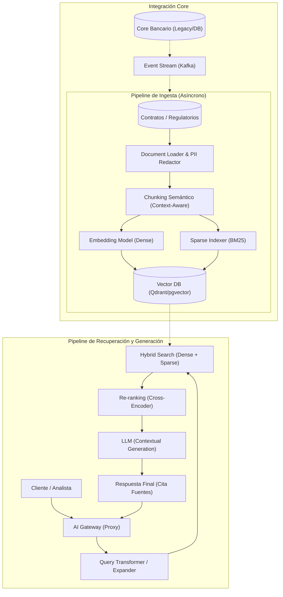

# Arquitectura RAG Enterprise: Búsqueda Híbrida e Integración Core Bancario
**Documento de Arquitectura de Referencia**
**Autor:** Principal Enterprise AI Architect, AI Office
**Clasificación:** Confidencial / Uso Interno

---

## 1. De RAG Ingenuo a RAG Enterprise en Banca

La implementación de sistemas de Generación Aumentada por Recuperación (RAG) en banca no admite la tolerancia al error del RAG "ingenuo". Mientras que un RAG básico (basado únicamente en embeddings vectoriales y búsqueda por similitud de coseno) funciona en entornos de uso general, fracasa estrepitosamente en el sector financiero debido a la terminología técnica, la necesidad de precisión absoluta en cifras y el cumplimiento normativo.

### 1.1. Limitaciones del RAG Ingenuo (Naive RAG)
*   **Pérdida de Precisión Léxica:** Los modelos de embedding (Dense Embeddings) suelen fallar al buscar términos técnicos exactos (ej. códigos ISIN, normativas específicas como "MiFID II Art. 25"), priorizando la similitud semántica general sobre la coincidencia léxica.
*   **Alucinaciones en Cifras:** Los modelos recuperan fragmentos que parecen relevantes pero que, al extraerse fuera de contexto, pierden la referencia numérica crítica necesaria para el cálculo financiero.
*   **Falta de Contexto Core:** No integran el estado actual del cliente en tiempo real, operando únicamente sobre documentos estáticos.

### 1.2. RAG Enterprise: El Enfoque Bancario
Un RAG de grado bancario (Enterprise RAG) se caracteriza por:
*   **Precisión Determinista:** Garantiza que si la información no está en el documento, el modelo responde "no tengo información" en lugar de alucinar.
*   **Trazabilidad:** Proporciona referencias bibliográficas exactas (página, párrafo, documento fuente) de cada respuesta, fundamental para auditorías (compliance).
*   **Consciencia Contextual:** Combina información no estructurada (contratos, PDFs regulatorios) con información estructurada del cliente (saldos, transacciones) proveniente del Core Bancario.

---

## 2. Estrategia de Búsqueda Híbrida y Re-ranking

Para lograr la precisión necesaria en la búsqueda de contratos y regulaciones bancarias, implementamos un pipeline de recuperación multicapa.

### 2.1. Recuperación Híbrida (Hybrid Search)
Combinamos dos mundos para maximizar el *Recall*:
1.  **Dense Retrieval (Embeddings):** Captura el significado semántico y la intención del usuario ("¿Qué implicaciones tiene el riesgo de crédito para hipotecas?").
2.  **Sparse Retrieval (BM25/Keyword Search):** Garantiza que términos técnicos, identificadores únicos o leyes específicas sean encontrados con precisión absoluta.

### 2.2. Re-ranking (Cross-Encoders)
La búsqueda híbrida devuelve un conjunto de candidatos (p. ej., top 50). Para refinar este conjunto:
*   **Re-ranker (Cross-Encoder):** Pasamos el par (Query, Documento Recuperado) por un modelo Cross-Encoder. A diferencia de los bi-encoders tradicionales, el Cross-Encoder procesa ambos elementos simultáneamente, analizando profundamente la relación de relevancia.
*   **Resultado:** Obtenemos una puntuación (score) de relevancia altamente calibrada, permitiendo al LLM trabajar solo con los 3-5 documentos que son verdaderamente pertinentes.

---

## 3. Patrones de Integración con el Core Bancario

Un sistema RAG en banca es inútil si está aislado. Debe integrarse con el ecosistema de datos de la entidad.

### 3.1. Arquitectura Basada en Eventos (Kafka)
*   **Ingesta en Tiempo Real:** Cuando un contrato es actualizado en el Core Bancario, se emite un evento Kafka que dispara el pipeline de ingesta del RAG (extracción, chunking, vectorización).
*   **Datos del Cliente:** El sistema RAG puede consultar perfiles de cliente enriquecidos mediante servicios gRPC o eventos de Kafka, permitiendo al sistema RAG contextualizar la respuesta según el perfil de riesgo del usuario.

### 3.2. AI Gateway REST/gRPC
*   Todo acceso al sistema RAG ocurre a través del AI Gateway, que aplica las políticas de seguridad, sanitización de PII (ver Docs 01) y rate-limiting antes de permitir que la query llegue al motor de recuperación.

---

## 4. Diagrama de Arquitectura RAG (Mermaid.js)

---
*Nota: Este documento debe leerse conjuntamente con las guías de cumplimiento del EU AI Act (Docs 01).*
