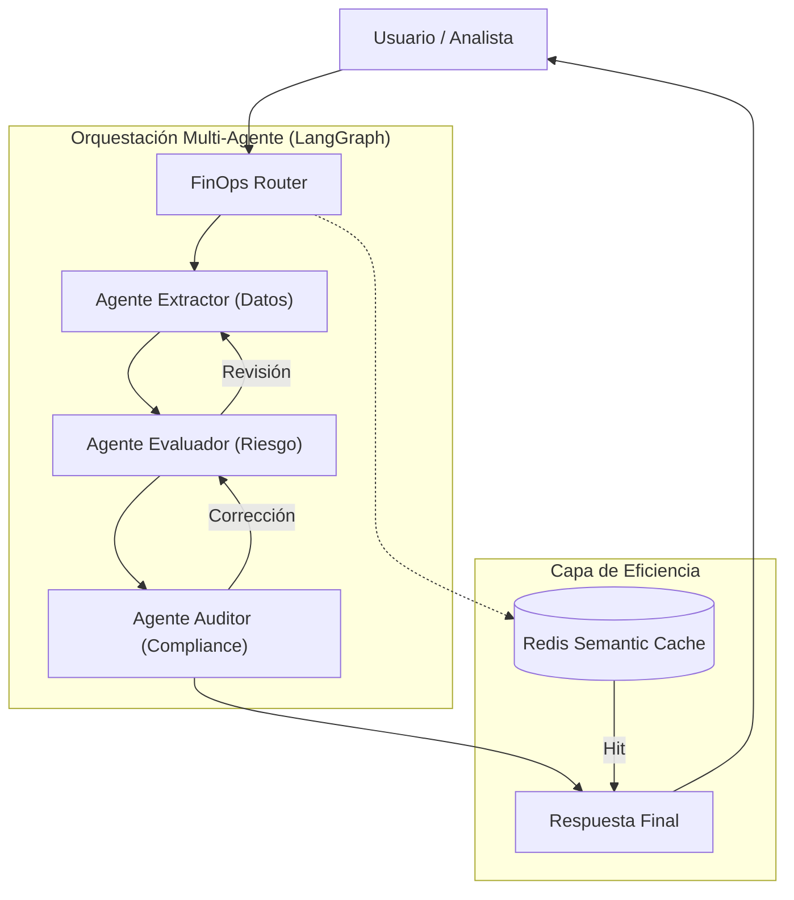

# Sistemas Multi-Agente, LLMOps y FinOps en Banca
**Documento de Arquitectura de Referencia**
**Autor:** Principal Enterprise AI Architect, AI Office
**Clasificación:** Confidencial / Uso Interno

---

## 1. Orquestación Multi-Agente Determinista

En banca, los flujos de trabajo críticos (ej. análisis de riesgo crediticio) no pueden depender de cadenas de prompt no estructuradas. Requerimos orquestación determinista.

### 1.1. LangGraph y Flujos de Trabajo en Ciclos
Utilizamos **LangGraph** para definir grafos de estados. A diferencia de cadenas simples, los grafos permiten:
*   **Ciclos de Revisión:** Si el Agente Evaluador detecta una inconsistencia, el sistema "buclea" de vuelta al Agente Extractor para corregir la información.
*   **Gestión de Estado Persistente:** Cada nodo del grafo conoce el estado histórico de la conversación, permitiendo auditoría forense de cada decisión tomada por un agente.

---

## 2. Estrategia de LLMOps: Calidad y Fiabilidad

La puesta en producción de IA bancaria exige un marco riguroso de LLMOps (LLM Operations).

### 2.1. Guardrails y Prevención de Alucinaciones
*   **NeMo Guardrails:** Implementamos capas de validación tanto en la entrada (input) como en la salida (output) para asegurar que el agente no responda sobre temas fuera de su dominio (ej. política, consejos de inversión no autorizados).
*   **Verificación mediante "Grounding":** Comparación cruzada de la respuesta del modelo contra las fuentes documentales recuperadas por el RAG. Si la respuesta contiene datos no presentes en la fuente, el output es bloqueado.

### 2.2. Monitorización y Detección de Deriva (Drift)
*   **Data Drift:** Monitorización de la distribución de los inputs de los usuarios.
*   **Model Drift:** Monitorización de la calidad de respuesta. Utilizamos herramientas de evaluación continua (ej. RAGAS) sobre un dataset de oro (Golden Dataset) para medir *Faithfulness* y *Relevance* periódicamente.

---

## 3. Estrategia de FinOps: Optimización de Costes

El coste de inferencia a gran escala puede comprometer el ROI del proyecto.

### 3.1. Caché Semántica
*   Implementamos **Semantic Caching** con Redis. Al recibir una consulta, realizamos una búsqueda de similitud vectorial. Si una query idéntica o muy similar ha sido respondida recientemente, devolvemos la respuesta de caché en milisegundos, evitando llamadas costosas a modelos frontier.

### 3.2. Router de Modelos (Model Routing)
*   **Enrutamiento Dinámico:** Un LLM de clasificación ligero (SLM) recibe la petición y determina la complejidad.
    *   *Tareas simples:* Enrutadas a SLMs locales (ej. Llama 3B/8B) alojados privadamente.
    *   *Tareas complejas:* Enrutadas a modelos frontier (ej. GPT-4o, Claude 3.5 Sonnet).

---

## 4. Diagrama de Orquestación Multi-Agente (Mermaid.js)

---
*Nota: Este documento completa el marco de trabajo iniciado con los Docs 01 y 02.*
