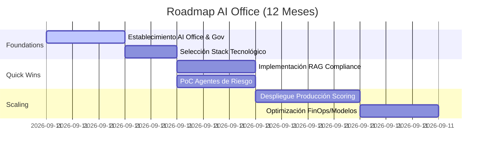

# Estrategia de IA: Roadmap de la AI Office, Gobernanza y ROI
**Documento de Asesoramiento Estratégico (C-Level & Executive)**
**Autor:** Principal Enterprise AI Architect, AI Office
**Clasificación:** Confidencial / Uso Interno

---

## 1. Matriz de Priorización de Casos de Uso
La adopción de IA debe ser metódica para evitar la dispersión. Priorizamos basándonos en el impacto de negocio frente a la complejidad regulatoria y técnica (Framework de Valor vs. Viabilidad).

| Caso de Uso | Impacto (ROI) | Complejidad | Prioridad |
| :--- | :--- | :--- | :--- |
| **Optimización de RAG para Compliance** | Alto | Media | **P1 (Quick Win)** |
| **Automatización de Scoring Crediticio** | Muy Alto | Muy Alta (Regulado) | **P2 (Estratégico)** |
| **Sistemas Multi-Agente para Auditoría** | Alto | Alta | **P2** |
| **Chatbots de Atención al Cliente (GenAI)** | Medio | Baja | **P3** |

---

## 2. Marco de Cálculo de ROI y TCO
Para justificar la inversión en la AI Office, utilizamos un modelo de ROI basado en **Valor Operativo generado - Coste Total de Propiedad (TCO)**.

### 2.1. Componentes del TCO (Coste Total de Propiedad)
*   **Infrastructura:** Cloud (AWS/Azure) + Modelos SaaS + Vector DBs.
*   **Talento:** Especialistas en LLMOps, AI Architects, Data Engineers.
*   **Gobernanza:** Costes de auditoría de cumplimiento (EU AI Act), herramientas de monitoreo (Guardrails).

### 2.2. Cálculo del Valor (ROI)
*   **Eficiencia:** Reducción de horas hombre (FTE) en procesos manuales (ej. revisión de contratos).
*   **Ingresos:** Aumento de ratio de conversión en venta cruzada (Cross-selling) mediante personalización.
*   **Riesgo:** Reducción de multas regulatorias y fraude (prevención proactiva).

---

## 3. Estructura Organizativa de la AI Office
El modelo operativo de la AI Office debe ser **híbrido (Centro de Excelencia + Nodos de Negocio)**.

*   **AI Architect:** Responsable de la visión técnica, stack tecnológico y estándares de arquitectura.
*   **AI Risk & Compliance Officer:** Punto de unión con Legal para garantizar el cumplimiento del EU AI Act.
*   **AI Product Owner:** Prioriza los casos de uso basándose en necesidades reales de negocio y ROI.
*   **LLMOps Engineer:** Asegura la fiabilidad del ciclo de vida, despliegue y monitoreo de modelos.

---

## 4. Roadmap a 12 Meses

Dividimos la ejecución en tres fases para asegurar una tracción sostenible.

### 4.1. Detalle de Fases
1.  **Foundations (Mes 1-3):** Constitución del equipo, definición de políticas de seguridad (Docs 01), selección de infraestructura.
2.  **Quick Wins (Mes 4-6):** Producción de herramientas RAG para el departamento legal y pruebas de concepto de agentes de riesgo.
3.  **Scaling (Mes 7-12):** Implementación de modelos de scoring bajo gobernanza EU AI Act, optimización profunda de costes (FinOps) y despliegue a gran escala.

---
*Este roadmap constituye la base para la presentación ante el Comité de Innovación.*
